<div align="center">

# 🎓 Student Exam Performance Predictor

**An end-to-end Machine Learning project** that predicts a student's **Math score** from demographic and academic inputs — trained with 8 regression models and served live through a Flask web app.

[](https://www.python.org/)
[](https://flask.palletsprojects.com/)
[](https://scikit-learn.org/)
[](https://xgboost.readthedocs.io/)
[](https://catboost.ai/)
[](#-license)

[Overview](#-overview) •
[Workflow](#-end-to-end-workflow) •
[Project Structure](#-project-structure) •
[Setup](#-setup--installation) •
[How It Works](#-how-it-works) •
[Results](#-model-results) •
[Roadmap](#-roadmap--known-issues)

</div>

---

## 📌 Overview

This project answers a simple question: **can a student's math score be predicted from their background and their other two exam scores?**

It's built as a complete, production-style ML pipeline rather than a single notebook — covering data ingestion, cleaning, transformation, model training/selection, and deployment behind a web interface. It's intentionally structured the way real ML systems are organized, making it a solid reference for anyone learning how a raw CSV turns into a usable, deployed model.

**Input features:**
- Gender
- Ethnicity / race-group
- Parental level of education
- Lunch type (standard / free-reduced)
- Test preparation course status
- Reading score
- Writing score

**Predicted output:** Math score (0–100)

---

## 🔁 End-to-End Workflow

```mermaid
flowchart LR
    A[📄 Raw Dataset<br/>stud.csv] --> B[🔍 EDA<br/>notebook/1 EDA.ipynb]
    B --> C[⚙️ Data Ingestion<br/>data_ingestion.py]
    C --> D[🧪 Train / Test Split<br/>80% / 20%]
    D --> E[🛠️ Data Transformation<br/>Impute → Encode → Scale]
    E --> F[🤖 Model Training<br/>8 regressors + GridSearchCV]
    F --> G[🏆 Best Model Selected<br/>by R² score]
    G --> H[💾 Artifacts Saved<br/>model.pkl + preprocessor.pkl]
    H --> I[🌐 Flask Web App<br/>app.py]
    I --> J[👤 User fills form<br/>home.html]
    J --> K[📈 Live Prediction<br/>predict_pipeline.py]
```



At a glance, the project has two independent halves:

| Phase | When it runs | What it does |
|---|---|---|
| **Training pipeline** | Once, offline | Reads raw data → cleans/encodes it → trains & compares 8 models → saves the best one to disk |
| **Serving pipeline** | Every time a user visits the site | Loads the saved model → takes new form input → returns a live prediction |

---

## 🗂 Project Structure

```
ml-project/
├── app.py                          # Flask web app (local dev entry point)
├── application.py                  # Same app, entry point used for deployment (e.g. AWS Elastic Beanstalk)
├── requirements.txt                # Python dependencies
├── setup.py                        # Makes src/ pip-installable
├── .ebextensions/                  # AWS Elastic Beanstalk deployment config
│
├── artifact/                       # Auto-generated at training time
│   ├── raw.csv                     # Unmodified copy of the source data
│   ├── train.csv / test.csv        # 80/20 train-test split
│   ├── preprocessor.pkl            # Saved data-cleaning/encoding pipeline
│   └── model.pkl                   # Saved best-performing trained model
│
├── notebook/
│   ├── data/stud.csv               # Original raw dataset
│   ├── 1 EDA.ipynb                 # Exploratory data analysis
│   └── 2 MODEL.ipynb               # Model prototyping / experimentation
│
├── templates/
│   ├── index.html                  # Landing page
│   └── home.html                   # Prediction form + result display
│
└── src/
    ├── logger.py                   # Central logging configuration
    ├── exception.py                # Custom exception handling (file + line number)
    ├── util.py                     # save_object / load_object / evaluate_models helpers
    ├── components/
    │   ├── data_ingestion.py       # Step 1 — load + split raw data
    │   ├── data_transformation.py  # Step 2 — clean, encode, scale data
    │   └── model_trainer.py        # Step 3 — train, tune, and select the best model
    └── pipeline/
        └── predict_pipeline.py     # Turns live form input into a prediction
```

---

## ⚙️ How It Works

### 1. Data Ingestion — `src/components/data_ingestion.py`
- Reads `notebook/data/stud.csv` into a pandas DataFrame.
- Saves an unmodified copy as `artifact/raw.csv`.
- Splits the data **80% train / 20% test** with `train_test_split`.
- Writes `artifact/train.csv` and `artifact/test.csv`.

### 2. Data Transformation — `src/components/data_transformation.py`
- **Numeric columns** (`reading_score`, `writing_score`): missing values filled with the median, then scaled with `StandardScaler`.
- **Categorical columns** (gender, ethnicity, parental education, lunch, test prep): missing values filled with the most frequent value, one-hot encoded, then scaled.
- Both pipelines are combined into a single `ColumnTransformer` — the **preprocessor**.
- The preprocessor is *fit* on training data and *applied* to both train/test sets, then saved to `artifact/preprocessor.pkl` so new incoming data is transformed identically at inference time.

### 3. Model Training — `src/components/model_trainer.py`
Trains and hyperparameter-tunes **8 regression algorithms**:

| Model | Type |
|---|---|
| Linear Regression | Linear |
| K-Neighbors Regressor | Instance-based |
| Decision Tree | Tree-based |
| Random Forest Regressor | Ensemble (bagging) |
| Gradient Boosting Regressor | Ensemble (boosting) |
| XGBoost Regressor | Ensemble (boosting) |
| CatBoost Regressor | Ensemble (boosting) |
| AdaBoost Regressor | Ensemble (boosting) |

- Each model is scored with **R²** on the held-out test set via `GridSearchCV` (see `evaluate_models()` in `src/util.py`).
- The best-scoring model is kept; training deliberately fails if the top score is below **0.6 R²**, as a sanity check against shipping a bad model.
- The winning model is serialized to `artifact/model.pkl`.

### 4. Serving — `app.py` + `src/pipeline/predict_pipeline.py`
1. `GET /predictdata` renders the input form (`templates/home.html`).
2. `POST /predictdata` reads all 7 form fields into a `CustomData` object.
3. `CustomData` converts the input into a single-row DataFrame using the **same column names** used during training.
4. `PredictPipeline.predict()` loads `model.pkl` + `preprocessor.pkl`, transforms the row through the identical preprocessing pipeline, and generates a prediction.
5. The predicted math score is rendered back on `home.html`.

---

## 🧰 Tech Stack

| Layer | Tools |
|---|---|
| **Language** | Python |
| **Data handling** | pandas, numpy |
| **Modeling** | scikit-learn, XGBoost, CatBoost |
| **Web framework** | Flask |
| **Serialization** | dill |

---

## 🚀 Setup & Installation

```bash
# 1. Clone the repository
git clone https://github.com/ManishaDutt11/ml-project.git
cd ml-project

# 2. Create and activate a virtual environment (recommended)
python -m venv venv
source venv/bin/activate        # Windows: venv\Scripts\activate

# 3. Install dependencies
pip install -r requirements.txt

# 4. Train the model — generates artifact/*.pkl and artifact/*.csv
python src/components/data_ingestion.py

# 5. Launch the web app
python app.py
```

Then open **`http://localhost:5000/predictdata`**, fill in the form, and submit to see a predicted math score.

---

## 📊 Model Results

The training pipeline benchmarks all 8 models on the same train/test split and reports R² on the held-out test set, keeping only the top performer. To see the exact numbers for a given run, check the console output of `data_ingestion.py`, or explore the comparison interactively in `notebook/2 MODEL.ipynb`.

> 💡 Want this table filled in with your live numbers? Run the training pipeline once and paste the printed R² scores here — it's a nice touch for a pinned repo.

---

## 🗺 Roadmap & Known Issues

Transparency matters — here's what's on the radar:

- [ ] **Cross-platform file paths** — some paths use Windows-style backslashes; replacing with `os.path.join(...)` will make the project portable to macOS/Linux.
- [ ] **Disable debug mode** — `app.py` currently runs with `debug=True`, fine for local dev but should be off for any public deployment.
- [ ] **Input validation** — add server-side validation for numeric fields beyond what the HTML form provides.
- [ ] **Add automated tests** — unit tests for the transformation and prediction pipelines.

Contributions and suggestions on any of the above are very welcome.

---

## 👩‍💻 Author

**Manisha Dutt**
[GitHub](https://github.com/ManishaDutt11)

<div align="center">

If this project helped you understand end-to-end ML pipelines, consider giving it a ⭐!

</div>
